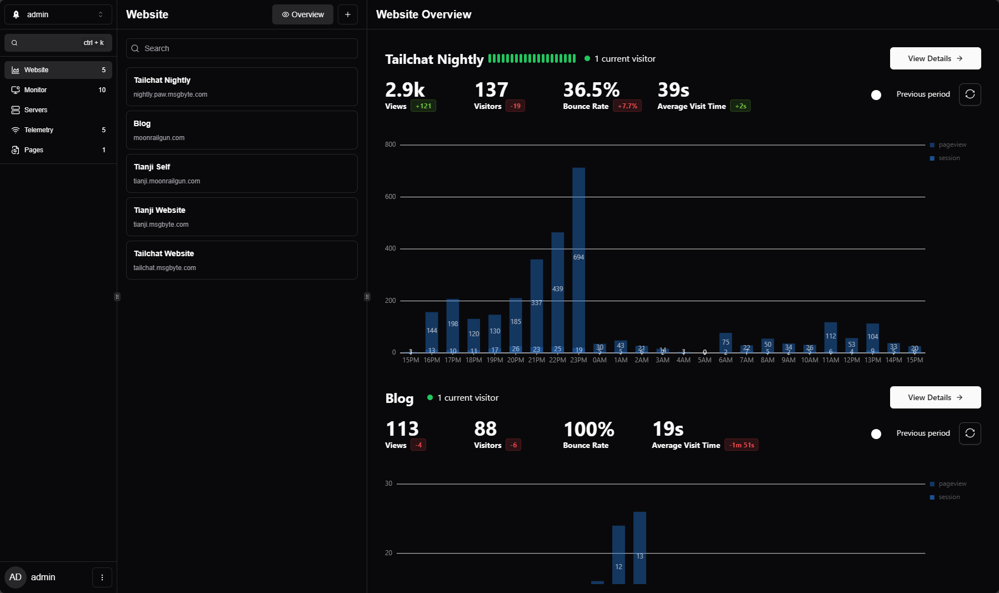
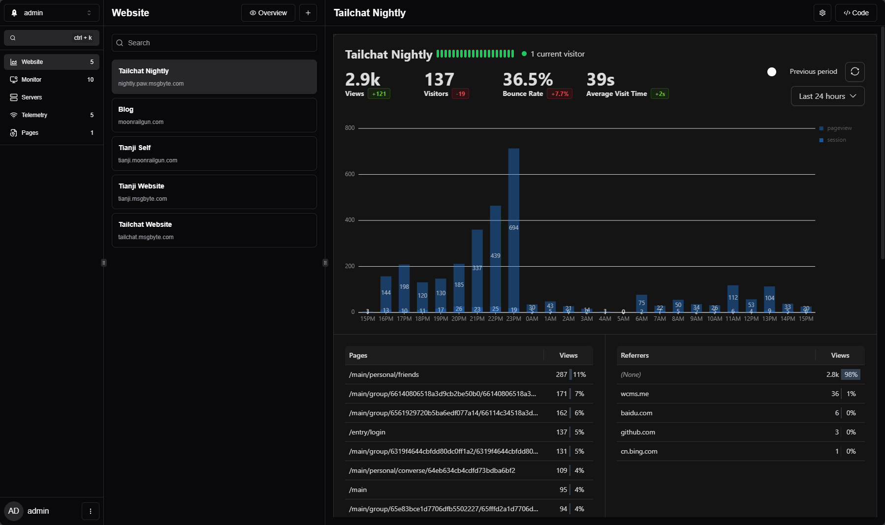
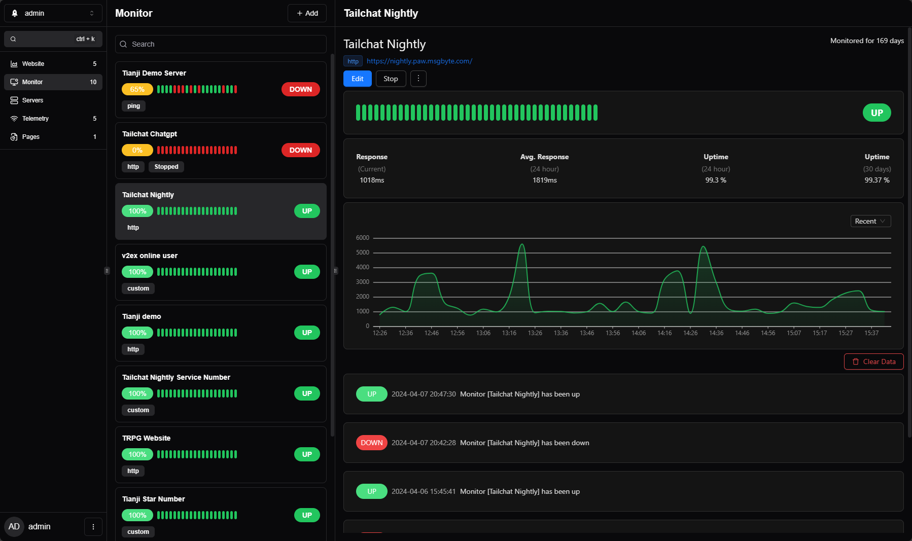
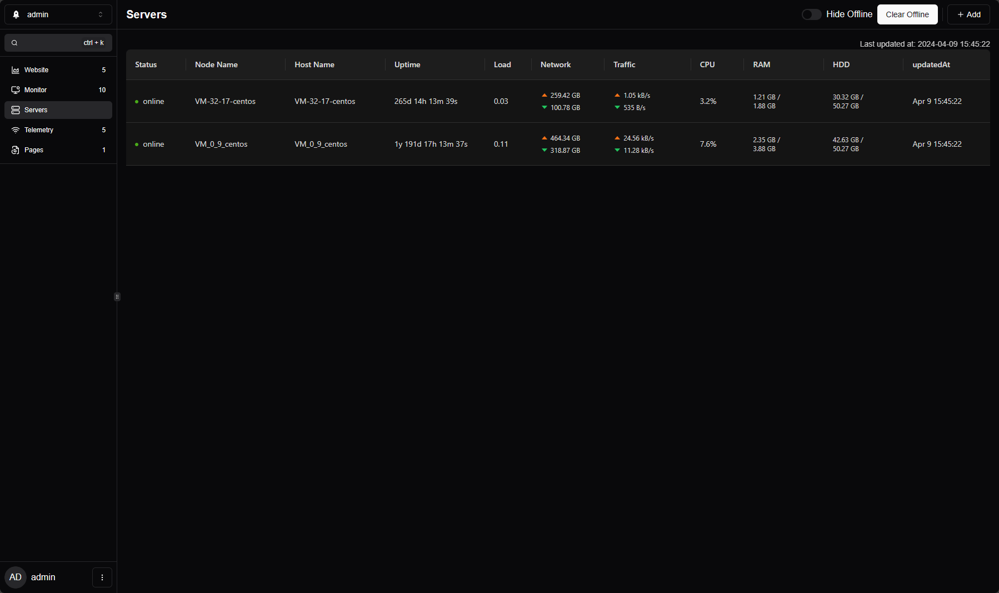
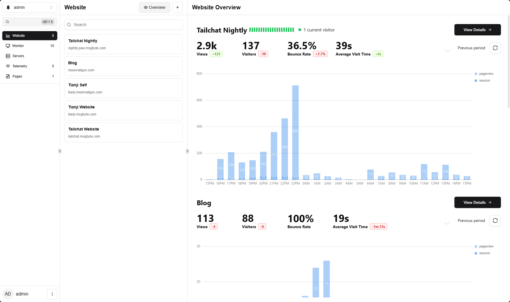
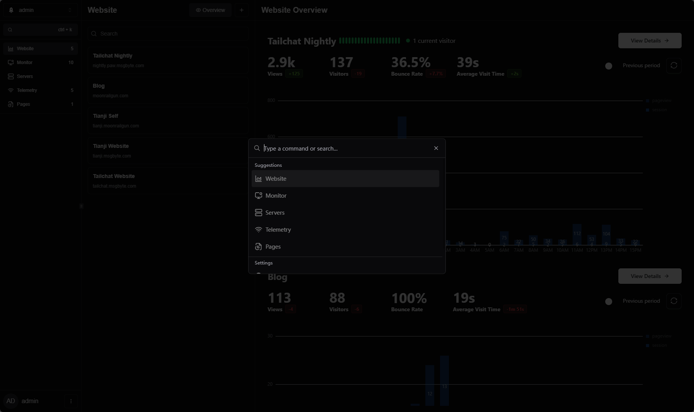

[](https://github.com/msgbyte/tianji/actions/workflows/ci.yaml)
[](https://github.com/msgbyte/tianji/actions/workflows/reporter-release.yml)
[](https://github.com/msgbyte/tianji/actions/workflows/ci-docker.yaml)


# Tianji


**All-in-One Insight Hub**

`Website analytics` + `Uptime Monitor`  + `Server Status` = `Tianji`

All in one project!

## Motivation

During our observations of the website. We often need to use multiple applications together. For example, we need analysis tools such as `GA`/`umami` to check pv/uv and the number of visits to each page, we need an uptime monitor to check the network quality and connectivity of the server, and we need to use prometheus to obtain the status reported by the server to check the quality of the server. In addition, if we develop an application that allows open source deployment, we often need a telemetry system to help us collect the simplest information about other people's deployment situations.

I think these tools should serve the same purpose, so is there an application that can integrate these common needs in a lightweight way? After all, most of the time we don't need very professional and in-depth functions. But in order to achieve comprehensive monitoring, I need to install so many services.

It's good to specialize in one thing, if we are experts in related abilities we need such specialized tools. But for most users who only have lightweight needs, an **All-in-One** application will be more convenient and easier to use.

## Roadmap

- [x] website analysis
- [x] monitor
  - [x] support passive reception of results
- [x] server status
- [x] problem notification
- [x] telemetry
- [x] openapi
- [x] website
- [x] team collaboration
- [x] utm track
- [x] waitlist
- [x] survey
  - [ ] survey page
- [x] lighthouse report
- [x] hooks
- [x] helm install support
  - [x] allow install from public
- [x] improve monitor reporter usage
  - [x] uninstall guide
  - [x] download from server
  - [x] custom params guide

## Preview













## Translation

### Add a new translation

modify those file:
- `src/client/i18next-toolkit.config.cjs` in this file, edit country code
- `src/client/utils/i18n.ts` in this file, add for display

Then, run below code to auto generate

```bash
cd src/client
pnpm install
pnpm run translation:extract
pnpm run translation:translate # this will call chatgpt to run auto translation, so you need set env `OPENAPI_KEY` to make sure run correct
```

Then manual check translation file in `src/client/public/locales`

### Improve translation

Direct update  `src/client/public/locales`

## Open Source

`Tianji` is open source with `Apache 2.0` license.

And its inspired by `umami` license which under `MIT` and `uptime-kuma` which under `MIT` license too

### One-Click Deployment

[](https://cloud.sealos.io/?openapp=system-template%3FtemplateName%3Dtianji)

[](https://repocloud.io/details/?app_id=270)

[](https://render.com/deploy?repo=https://github.com/msgbyte/tianji)

[](https://template.run.claw.cloud/?referralCode=TNW6NVWTLHPQ&openapp=system-fastdeploy%3FtemplateName%3Dtianji)
