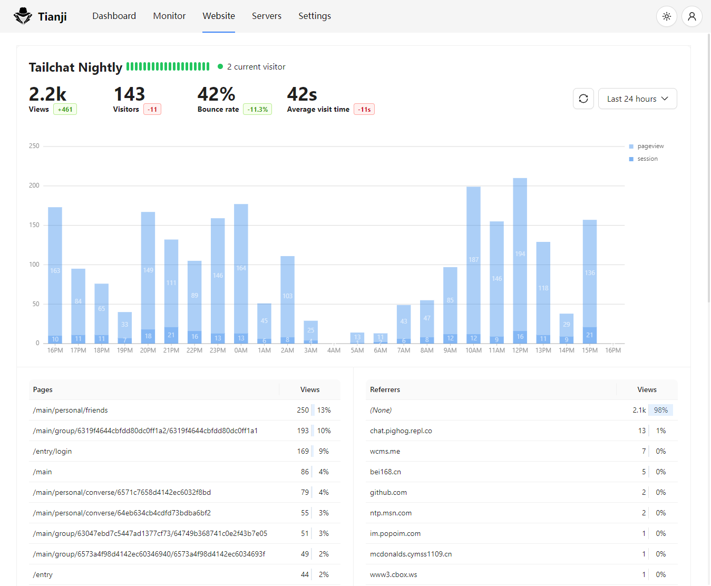
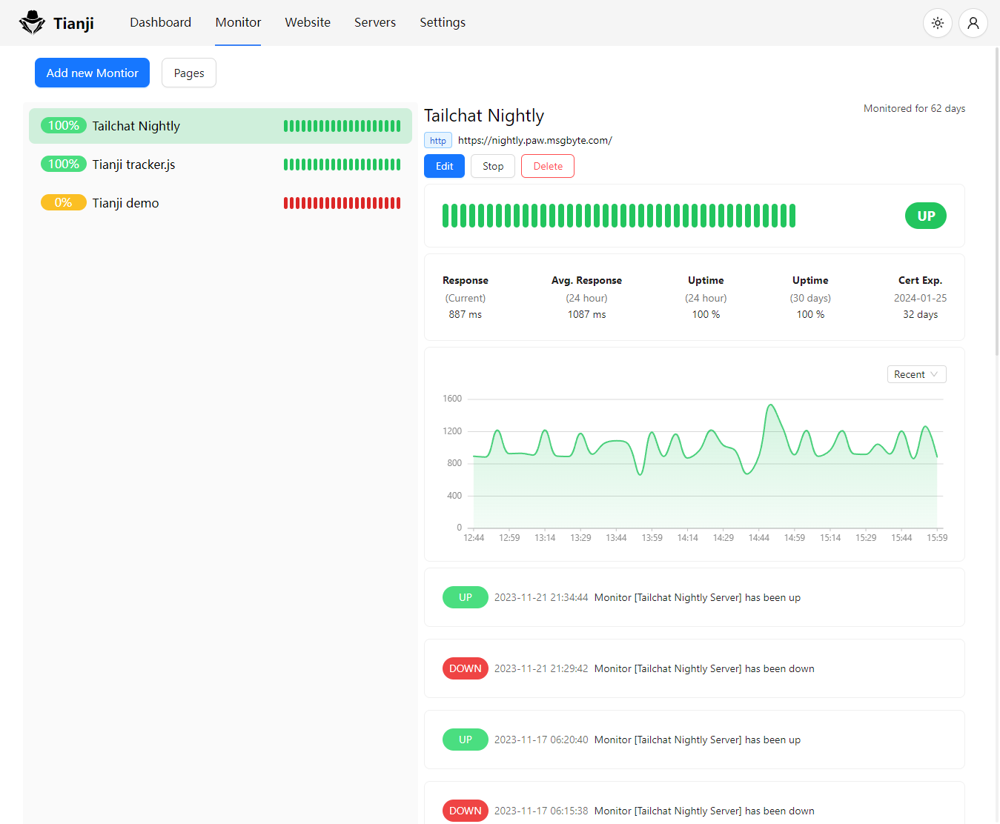
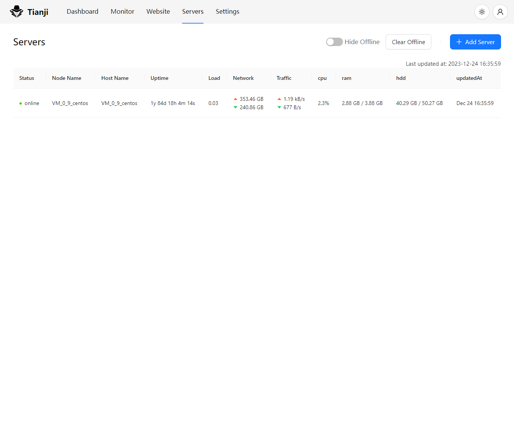

# 天机 Tianji

**洞察一切**

`网站分析器` + `状态监控器` + `服务状态上报` = `Tianji`

所有一切都在一起!

## Motivation

在我们对网站进行观察时。我们往往需要多个应用一起来组合使用。比如我们需要ga/umami等分析工具来查看pvuv以及各个页面的访问量，我们需要uptime监控器来检查服务器的网络质量与连通性，我们需要通关prometheus获取服务端上报的状态来检查服务器的质量。另外如果开发的是一个允许被开源部署的应用，我们往往还需要一个遥测系统来帮助我们对其他人的部署情况做一个最简单的信息收集。

我认为这些工具应当是为同一个目的而服务的，那么有没有一款应用能够轻量级的将这些常见的需求整合为一体呢？毕竟在大部分时候我们并不需要非常专业与深入的功能。但是我为了实现全面的监控却需要安装如此多的服务。

专精于一项这很好，如果我们是相关能力的专家我们需要这样的专业工具。但是对于大部分只有轻量级需求的用户而言，一个all in one的应用会更加方便与易于使用

## Preview

## Open Source

`Tianji` is open source with `Apache 2.0` license.

And its inspired by `umami` license which under `MIT` and `uptime-kuma` which under `MIT` license too
