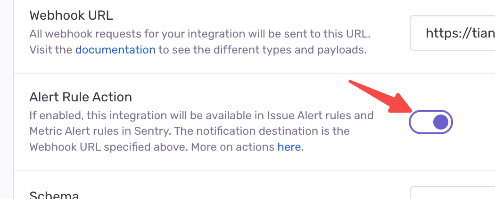

# Integration with Sentry

:::info
Learn more about sentry in [sentry.io](https://sentry.io/)
:::

Click `Settings` => `Integrations` => `Create New Integration`

Create a `Internal Integration` application

Input name `Tianji` and put in webhook url into form.

Don't forget enable `Alert Rule Action`

Then, add issue read `permission`, and webhook add `issue` and `error`

Finally, you can create a alert rule, and you can see `Tianji` in notification section dropdown list

